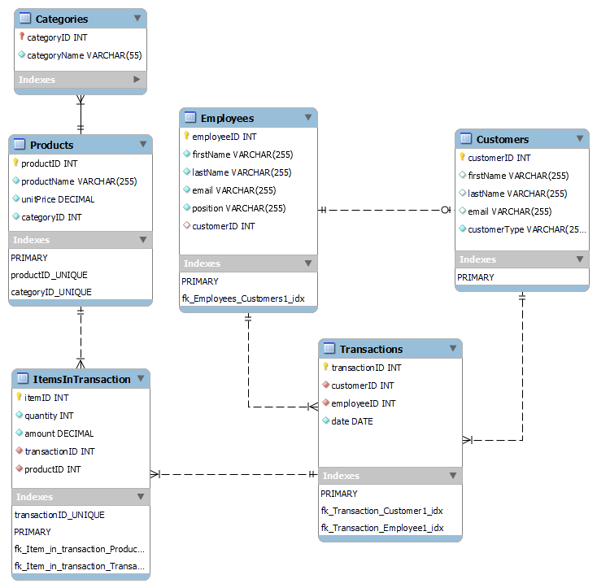
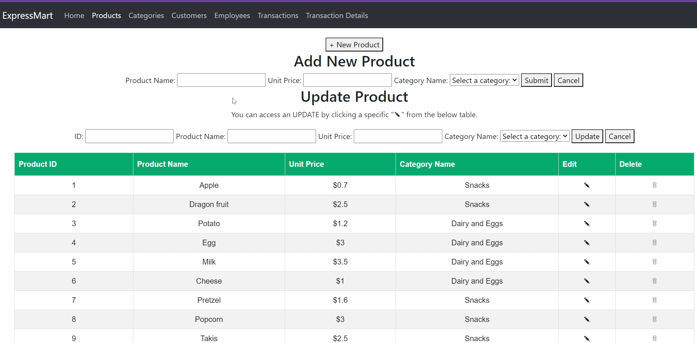
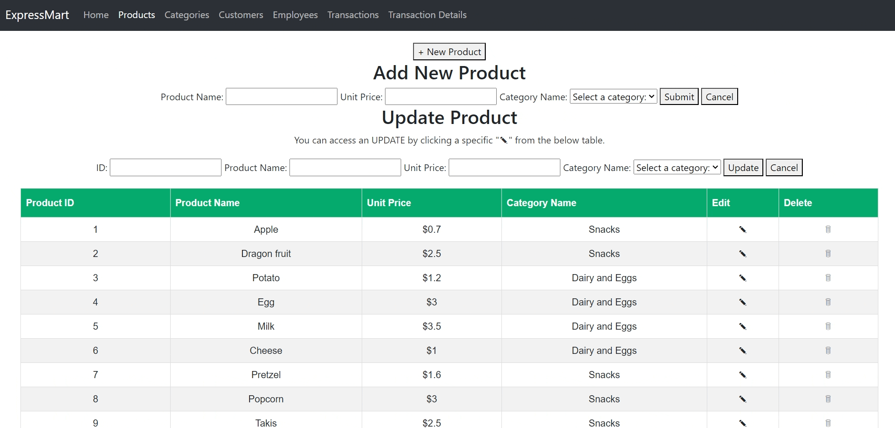
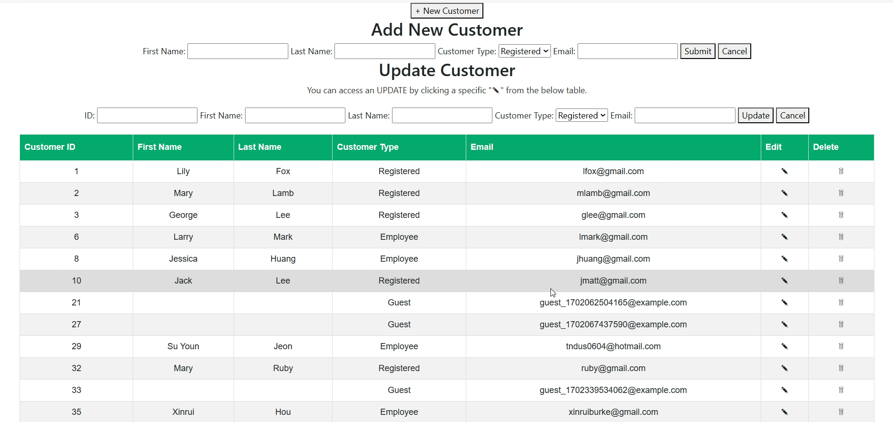
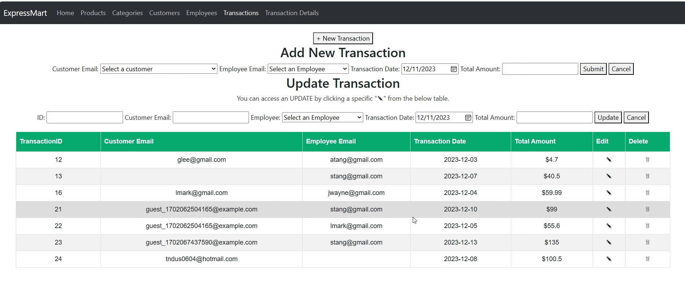
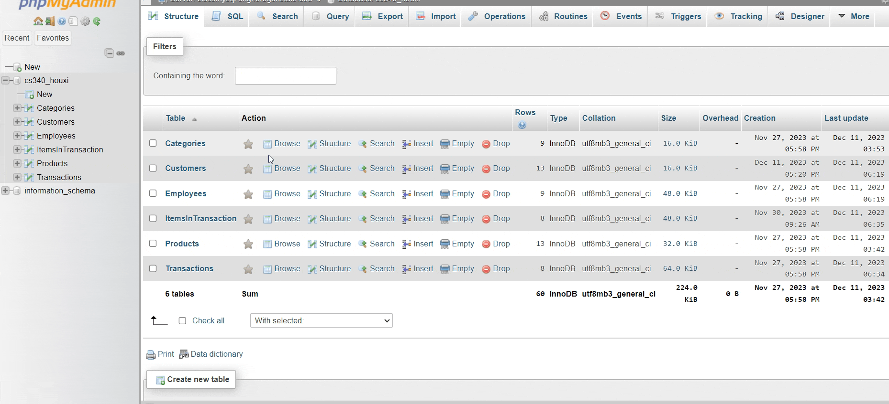

# CS340 Database Portfolio Project - Express Mart
 
The project involves the development of a web-based user interface (UI) designed to facilitate Create-Read-Update-Delete (CRUD) functionalities. The UI is built using Node.js and Handlebars, serving content over the web. The backend is powered by an SQL-driven database (MariaDB).
 
## Authors
 
- [Su Youn Jeon](https://github.com/tndus604)
- [Xinrui Hou](https://github.com/superhermione)
 
## Table of Contents
1. [Overview](#overview)
2. [Database Outline](#database-outline)
3. [Schema](#schema)
4. [Navigation](#navigation)
5. [Citation](#citation)
 
## Overview
ExpressMart is a grocery store with an annual revenue of $1.5 million and employing a staff of 50 individuals. In order to operate the business efficiently, they need a website with a robust database backend for the purpose of recording sales orders for products to customers. This system will facilitate the tracking of more than 100,000 sales transactions each year, helping to analyze sales patterns, customer preferences, and identification of potential product additions, ultimately leading to improved customer service and continued growth in their highly competitive market.  
 
## Database Outline
* **Homepage** - navigates users to other pages to interact with database.
* **Products** - documents the inventary data for products.
* **Categories** - relational entity to Products, documents products category.
* **Customers** - stores customers' data including names, emails and customer types.
* **Employees** - stores employees' data including names, emails and positions.
* **Transactions** - documents ExpressMart's transaction data including customer email, employee email, transaction date and total amount.
* **Transaction Detail** - records details for each transaction including items, quantity and amount.
 
## Schema

 
## Nevigation
 
* **Homepage walkthrough** - visually presents the six functional pages that users can interact with our ExpressMart database.

 
* **Products page walkthrough** - users are able to conduct CRUD (create, read, update and delete) operations with this page. All data are altered in Maria Database simultaneously.

 
* **Categories page walkthrough** - users are able to conduct CRUD (create, read, update and delete) operations with the categories table. All data are altered in Maria Database simultaneously.

 
* **Customers page walkthrough** - users are able to conduct CRUD (create, read, update and delete) operations with the customers table. For customer type attribute, the users are able to choose among three types in which promopt messages are showing to assist the user input. All data are altered in Maria Database simultaneously.

* **Employees page walkthrough** - users are able to conduct CRUD (create, read, update and delete) operations with the employees table. Users will leave a blank if the employee is not a customer. All data are altered in Maria Database simultaneously.

 
* **Transactions page walkthrough** - users are able to conduct CRUD (create, read, update and delete) operations with the transactions table. Users are able to create a transaction by fetching customer emails and employee emails. All data are altered in Maria Database simultaneously. On our UI, no foreign keys are requested from the user.

* **Transaction Details page walkthrough** - users are able to conduct CRUD (create, read, update and delete) operations with the transaction details table. Users are able to target a transaction by fetching customer emails and transaction date. All data are altered in Maria Database simultaneously. On our UI, no foreign key are requested from the user.

* **Maria Database walkthrough** - This database was designed and normalized on the first sprint using mysql on Maria Database through a server. All pages' CRUDs interact with this databse through our server code in app.js, frontend implementations in handlebar files as well as backend js files. 

 
## Citation
 
- The code structure is derived from the [Node.js Starter Guide](https://github.com/osu-cs340-ecampus/nodejs-starter-app/tree/main/) provided by CS340 at Oregon State University. Code and comments have been adapted from this repository.
 
 
- The conversion of date to string format "yyyy-mm-dd" is based on a solution found on Stack Overflow by user user3364059 and edited by user [NXT](https://stackoverflow.com/users/1554649/nxt). The original answer can be found [here](https://stackoverflow.com/questions/15411833/using-moment-js-to-convert-date-to-string-mm-dd-yyyy).

- All walkthroughs are created by https://gifcap.dev/ 
 